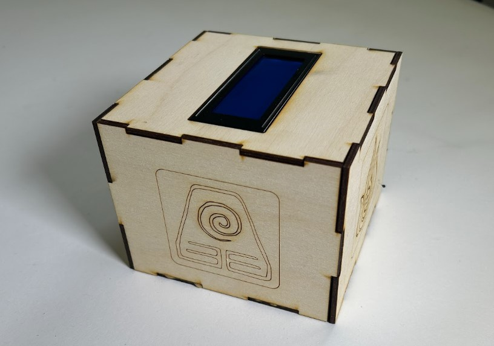
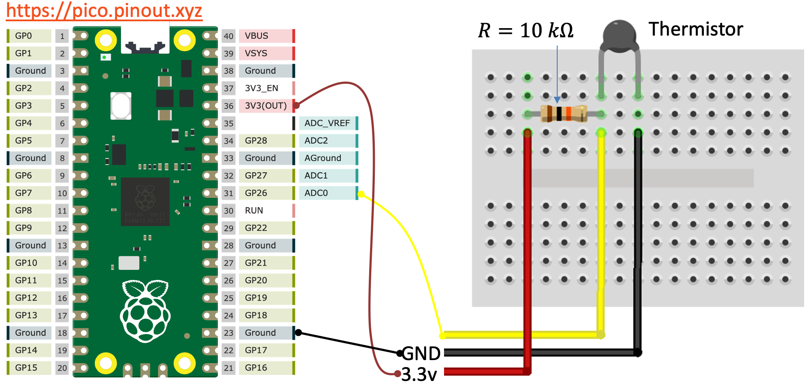

# Avatar Temperature Monitor

This project incorporates a temperature sensor (thermistor) with various physical outputs, integrates an I2C device, communicates with an Adafruit dashboard using MQTT, and even adjusts the temperature unit based on the color detected by a computer camera.

## Table of Contents

- [Features](#features)
- [How It Works](#howitworks)
- [Demo](#demo)
- [Resources](#resources)
  

## Features

- 🌡️ **Temperature Sensor (Thermistor):** Provides physical output of temperature readings (screen display).
- 📋 **Adafruit Dashboard Integration:** Pushes temperature readings to an Adafruit dashboard every 5 seconds via MQTT, ensuring real-time updates.
- 🛠️ **I2C Device Integration:** Integrates an I2C device for enhanced functionality and interactivity.
- 🎨 **Color-Based Unit Conversion:** Automatically switches temperature unit (Fahrenheit to Celsius and vice versa) based on the color detected by the computer camera.
- 📝 **Airtable Integration:** Reads Airtable entries using REST API, stores color information, and communicates with the Raspberry Pi Pico and computer.
- 🚀 **MQTT Communication:** Enables seamless communication between the computer and Adafruit dashboard, ensuring accurate data transmission.

## How It Works

A thermistor is an element with an electrical resistance that changes in response to temperature. Thermistors have the advantage of a very high sensitivity to temperature changes, but the disadvantage of an aggressively nonlinear characteristic. Here is a characteristic curve showing the resistance of a typical negative temperature coefficient thermistor device over a temperature range from 0 to 100 degrees C.

As seen from figure 1, the value changes from over 15k ohms to under 100 ohms. The change is most rapid at low temperatures, giving great resolution for determining the corresponding temperature values there. At the other end of the range, resistance levels change relatively less with temperature and measurement resolution is relatively poor. The resistance measurement of the thermistor is not normalized, so the measured value of Rt in ohms is used. Manufacturers can provide typical values of the ka, kb, and kc coefficients, or you can calibrate these values for better accuracy. The way to physcially calibrate it would be to use three temperatures, ranging across the entirety of the curve in Figure 1. Some easy temperatures to use would be ice water, room temperature water, and boiling water, noting the resistances for each instance. Once you have these values you can do some matrix math and solve for the three coefficients. For this case, I used [this website](https://www.mstarlabs.com/sensors/thermistor-calibration.html#:~:text=Power%20the%20thermistor%20from%20a,thermistor%20and%20load%20resistor%20join.&text=The%20goal%20is%20to%20obtain,between%20temperature%20and%20measured%20voltage.) which did all that for me, although it used different temperatures.

For NTC thermistors, the Steinhart-Hart equation is commonly used:

$$
T = \left(\frac{1}{A + B\ln(R) + C(\ln(R))^3}\right)^{-1}
$$

Where:
- T is the temperature in Kelvin (K).
- R is the resistance of the thermistor in ohms.
- A, B, and N are the B-parameters specific to the thermistor.

Curve forms are available that describe the nonlinear shape of the thermistor characteristic quite well. The most commonly used form is the Steinhart-Hart Equation. The resistance measurement of the thermistor is not normalized, so just use the measured value of Rt in ohms. Manufacturers can provide typical values of the ka, kb, and kc coefficients, or you can calibrate these values for better accuracy.

The temperature is then displayed on the I2C display depending on the color read from Airtable. However, before we continue let's talk about how the color gets to Airtable. Camera.py runs on a computer. An image is snapped and is processed. The processing determines the dominant color between red and green. After the script determines which color is dominant it sends that color to Airtable via requests. Once the color has been updated main.py on the Pico reads that color. In this case, if the color is green then the temperature will read in Celsius and in Fahrenheit if the color is red. Meanwhile, the temperature readings and the dominant color are sent to the Adafruit Dashboard every 5 seconds. 

## Demo
                                          
CLICK ⬇️

## Resources
[Thermistor](https://www.thinksrs.com/downloads/pdfs/applicationnotes/LDC%20Note%204%20NTC%20Calculator.pdf)
[Thermistor](https://www.youtube.com/watch?v=aUPvASe8D-w&t=1987s&pp=ygURdGhlcm1pc3RvciBweXRob24%3D)
[I2C Screen](https://www.youtube.com/watch?v=bXLgxEcT1QU)
[Airtable](https://www.youtube.com/watch?v=_GscWfr7RXU)
[AdaFruit Dashboard](https://www.youtube.com/watch?v=ybCMXqsQyDw&t=352s)

